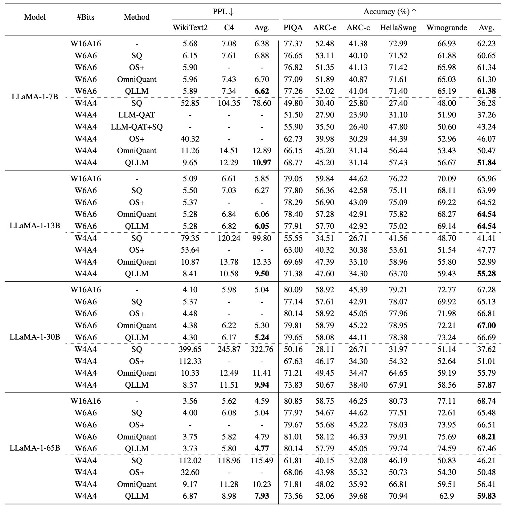
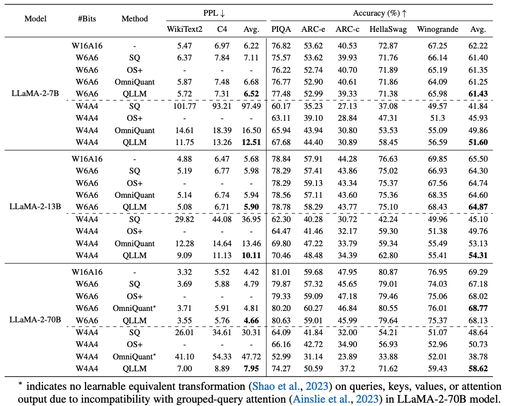

# QLLM: Accurate and Efficient Low-Bitwidth Quantization for Large Language Models (ICLR 2024)

[](https://opensource.org/licenses/Apache-2.0) 
[](https://arxiv.org/abs/2310.08041)

This is the official PyTorch implementation of [QLLM: Accurate and Efficient Low-Bitwidth Quantization for Large Language Models](https://arxiv.org/abs/2310.08041).

By [Jing Liu](https://jing-liu.com/), [Ruihao Gong](https://xhplus.github.io/), [Xiuying Wei](https://wimh966.github.io/), [Zhiwei Dong](https://zwdong.com.cn/), [Jianfei Cai](https://jianfei-cai.github.io/), and [Bohan Zhuang](https://bohanzhuang.github.io/).


We propose QLLM, an accurate and efficient low-bitwidth post-training quantization method designed for LLMs.

## 📰 News
- [10-03-2024]  Release the code!🌟
- [17-01-2024] QLLM is accepted by ICLR 2024! 👏

## 📖 Contents
- [Install](#🛠-install)
- [Usage](#⚙️-usage)
- [Results](#📋-results)
- [Citation](#📝-citation)
- [License](#🧾-license)
- [Acknowledgement](#🙏-acknowledgement)

## 🛠 Install
```
conda create -n qllm python=3.10 -y
conda activate qllm
git clone https://github.com/ModelTC/QLLM
cd QLLM
pip install --upgrade pip 
pip install -e .
```

## ⚙️ Usage
We provide the training scripts in `scripts` folder. For example, to perform W4A8 quantization for LLaMA-7B, run
```
sh scripts/llama-7b/w4a4.sh
```
Remember to change the path of model `model` and output path `output_dir`.

## 📋 Results
* QLLM achieve SoTA performance in weight-activation quantization




## 📝 Citation
If you find our `QLLM` useful in your research, please consider to cite the following related papers:
```
@inproceedings{liu2024qllm,
  title = {{QLLM}: Accurate and Efficient Low-Bitwidth Quantization for Large Language Models},
  author = {Liu, Jing and Gong, Ruihao and Wei, Xiuying and Dong, Zhiwei and Cai, Jianfei and Zhuang, Bohan},
  booktitle = {International Conference on Learning Representations (ICLR)},
  year = {2024},
}
```

## 🧾 License
This repository is released under the Apache 2.0 license as found in the [LICENSE](./LICENSE) file.

## 🙏 Acknowledgement
This repository is built upon [OmniQuant](https://github.com/OpenGVLab/OmniQuant). We thank the authors for their open-sourced code.